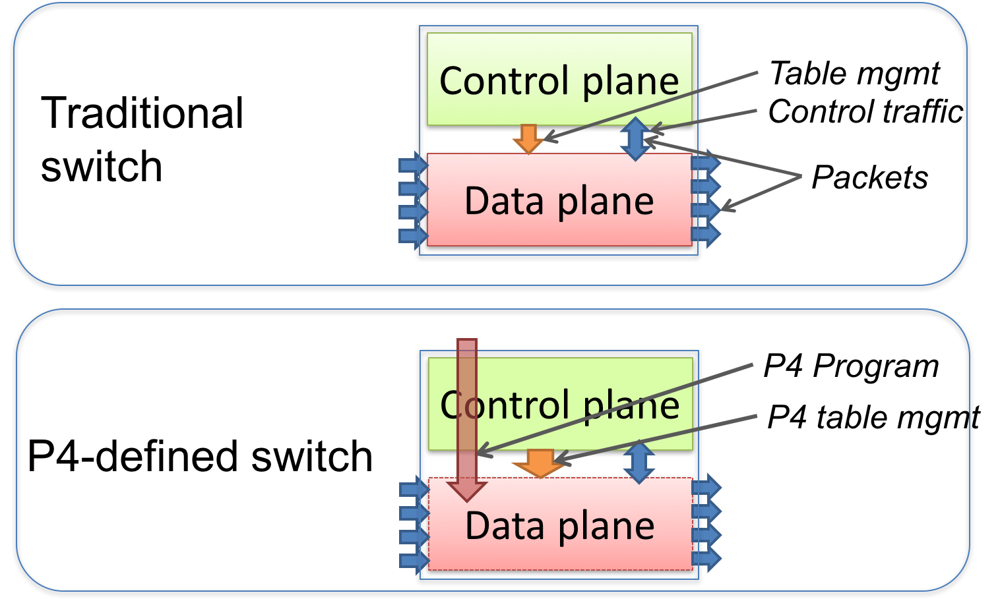
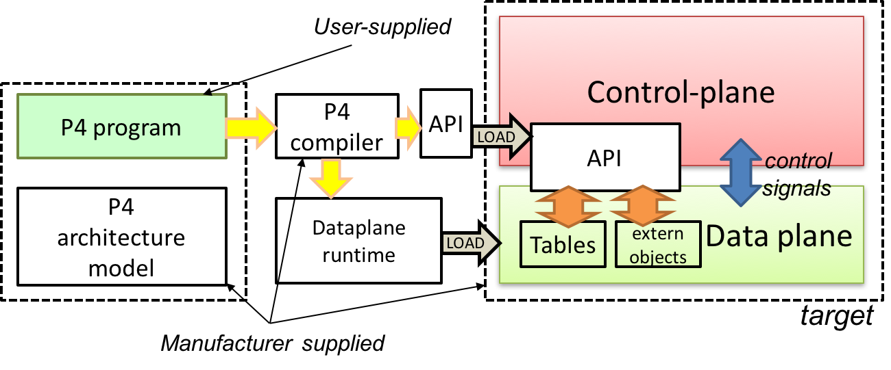
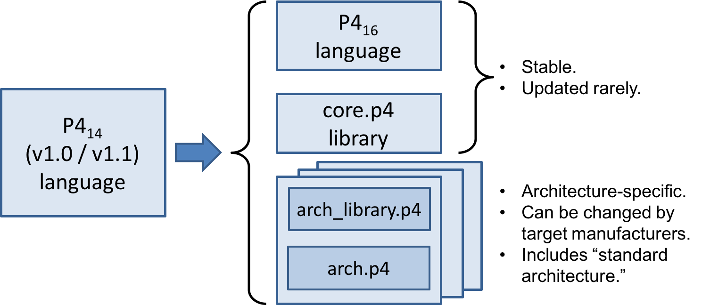

# 3. Overview

  

**Figure 1**. Traditional switches vs. programmable switches.

P4 is a language for expressing how packets are processed by the data plane of a programmable forwarding element such as a hardware or software switch, network interface card, router, or network appliance. The name P4 comes from the original paper that introduced the language, “Programming Protocol-independent Packet Processors,” https://​arxiv.​org/​pdf/​1312.​1719.​pdf. While P4 was initially designed for programming switches, its scope has been broadened to cover a large variety of devices. In the rest of this document we use the generic term target for all such devices.

Many targets implement both a control plane and a data plane. P4 is designed to specify only the data plane functionality of the target. P4 programs also partially define the interface by which the control plane and the data-plane communicate, but P4 cannot be used to describe the control-plane functionality of the target. In the rest of this document, when we talk about P4 as “programming a target”, we mean “programming the data plane of a target”.

As a concrete example of a target, Figure 1 illustrates the difference between a traditional fixed-function switch and a P4-programmable switch. In a traditional switch the manufacturer defines the data-plane functionality. The control-plane controls the data plane by managing entries in tables (e.g. routing tables), configuring specialized objects (e.g. meters), and by processing control-packets (e.g. routing protocol packets) or asynchronous events, such as link state changes or learning notifications.

A P4-programmable switch differs from a traditional switch in two essential ways:

- The data plane functionality is not fixed in advance but is defined by a P4 program. The data plane is configured at initialization time to implement the functionality described by the P4 program (shown by the long red arrow) and has no built-in knowledge of existing network protocols.
- The control plane communicates with the data plane using the same channels as in a fixed-function device, but the set of tables and other objects in the data plane are no longer fixed, since they are defined by a P4 program. The P4 compiler generates the API that the control plane uses to communicate with the data plane.
Hence, P4 can be said to be protocol independent, but it enables programmers to express a rich set of protocols and other data plane behaviors.

  

**Figure 2**. Programming a target with P4.

The core abstractions provided by the P4 language are:

- **Header types** describe the format (the set of fields and their sizes) of each header within a packet.
- **Parsers** describe the permitted sequences of headers within received packets, how to identify those header sequences, and the headers and fields to extract from packets.
- **Tables** associate user-defined keys with actions. P4 tables generalize traditional switch tables; they can be used to implement routing tables, flow lookup tables, access-control lists, and other user-defined table types, including complex multi-variable decisions.
- **Actions** are code fragments that describe how packet header fields and metadata are manipulated. Actions can include data, which is supplied by the control-plane at runtime.
- **Match-action units** perform the following sequence of operations:
   + Construct lookup keys from packet fields or computed metadata,
   + Perform table lookup using the constructed key, choosing an action (including the associated data) to execute, and
   + Finally, execute the selected action.
- **Control flow** expresses an imperative program that describes packet-processing on a target, including the data-dependent sequence of match-action unit invocations. Deparsing (packet reassembly) can also be performed using a control flow.
- **Extern objects** are architecture-specific constructs that can be manipulated by P4 programs through well-defined APIs, but whose internal behavior is hard-wired (e.g., checksum units) and hence not programmable using P4.
- **User-defined metadata:** user-defined data structures associated with each packet.
- **Intrinsic metadata:** metadata provided by the architecture associated with each packet—e.g., the input port where a packet has been received.

Figure 2 shows a typical tool workflow when programming a target using P4.

Target manufacturers provide the hardware or software implementation framework, an architecture definition, and a P4 compiler for that target. P4 programmers write programs for a specific architecture, which defines a set of P4-programmable components on the target as well as their external data plane interfaces.

Compiling a set of P4 programs produces two artifacts:

- a data plane configuration that implements the forwarding logic described in the input program and
- an API for managing the state of the data plane objects from the control plane

P4 is a domain-specific language that is designed to be implementable on a large variety of targets including programmable network interface cards, FPGAs, software switches, and hardware ASICs. As such, the language is restricted to constructs that can be efficiently implemented on all of these platforms.

Assuming a fixed cost for table lookup operations and interactions with extern objects, all P4 programs (i.e., parsers and controls) execute a constant number of operations for each byte of an input packet received and analyzed. Although parsers may contain loops, provided some header is extracted on each cycle, the packet itself provides a bound on the total execution of the parser. In other words, under these assumptions, the computational complexity of a P4 program is linear in the total size of all headers, and never depends on the size of the state accumulated while processing data (e.g., the number of flows, or the total number of packets processed). These guarantees are necessary (but not sufficient) for enabling fast packet processing across a variety of targets.

*P4 conformance* of a target is defined as follows: if a specific target T supports only a subset of the P4 programming language, say P4T, programs written in P4T executed on the target should provide the exact same behavior as is described in this document. Note that P4 conformant targets can provide arbitrary P4 language extensions and ***extern*** elements.

## 3.1. Benefits of P4

Compared to state-of-the-art packet-processing systems (e.g., based on writing microcode on top of custom hardware), P4 provides a number of significant advantages:

- **Flexibility**: P4 makes many packet-forwarding policies expressible as programs, in contrast to traditional switches, which expose fixed-function forwarding engines to their users.
- **Expressiveness**: P4 can express sophisticated, hardware-independent packet processing algorithms using solely general-purpose operations and table look-ups. Such programs are portable across hardware targets that implement the same architectures (assuming sufficient resources are available).
- **Resource mapping and management**: P4 programs describe storage resources abstractly (e.g., IPv4 source address); compilers map such user-defined fields to available hardware resources and manage low-level details such as allocation and scheduling.
- **Software engineering**: P4 programs provide important benefits such as type checking, information hiding, and software reuse.
- **Component libraries**: Component libraries supplied by manufacturers can be used to wrap hardware-specific functions into portable high-level P4 constructs.
- **Decoupling hardware and software evolution**: Target manufacturers may use abstract architectures to further decouple the evolution of low-level architectural details from high-level processing.
- **Debugging**: Manufacturers can provide software models of an architecture to aid in the development and debugging of P4 programs.

## 3.2. P4 language evolution: comparison to previous versions (P4 v1.0/v1.1)

  

**Figure 3**. Evolution of the language between versions P414 (versions 1.0 and 1.1) and P416.

Compared to P414, the earlier version of the language, P416 makes a number of significant, backwards-incompatible changes to the syntax and semantics of the language. The evolution from the previous version (P414) to the current one (P416) is depicted in Figure 3. In particular, a large number of language features have been eliminated from the language and moved into libraries including counters, checksum units, meters, etc.

Hence, the language has been transformed from a complex language (more than 70 keywords) into a relatively small core language (less than 40 keywords, shown in Section B) accompanied by a library of fundamental constructs that are needed for writing most P4.

The v1.1 version of P4 introduced a language construct called extern that can be used to describe library elements. Many constructs defined in the v1.1 language specification will thus be transformed into such library elements (including constructs that have been eliminated from the language, such as counters and meters). Some of these extern objects are expected to be standardized, and they will be in the scope of a future document describing a standard library of P4 elements. In this document we provide several examples of extern constructs. P416 also introduces and repurposes some v1.1 language constructs for describing the programmable parts of an architecture. These language constructs are: parser, state, control, and package.

One important goal of the P416 language revision is to provide a stable language definition. In other words, we strive to ensure that all programs written in P416 will remain syntactically correct and behave identically when treated as programs for future versions of the language. Moreover, if some future version of the language requires breaking backwards compatibility, we will seek to provide an easy path for migrating P416 programs to the new version.

