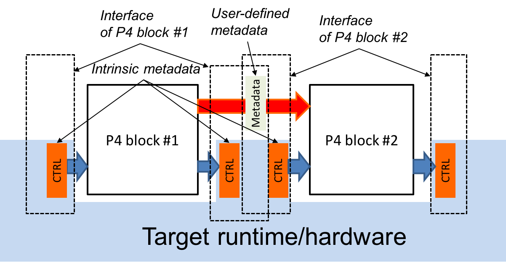

# 4. Architecture Model

<div style="inline">
  
</div>

**Figure 4**. P4 program interfaces.

The ***P4 architecture*** identifies the P4-programmable blocks (e.g., parser, ingress control flow, egress control flow, deparser, etc.) and their data plane interfaces.

The P4 architecture can be thought of as a contract between the program and the target. Each manufacturer must therefore provide both a P4 compiler as well as an accompanying architecture definition for their target. (We expect that P4 compilers can share a common front-end that handles all architectures). The architecture definition does not have to expose the entire programmable surface of the data plane—a manufacturer may even choose to provide multiple definitions for the same hardware device, each with different capabilities (e.g., with or without multicast support).

Figure 4 illustrates the data plane interfaces between P4-programmable blocks. It shows a target that has two programmable blocks (#1 and #2). Each block is programmed through a separate fragment of P4 code. The target interfaces with the P4 program through a set of control registers or signals. Input controls provide information to P4 programs (e.g., the input port that a packet was received from), while output controls can be written to by P4 programs to influence the target behavior (e.g., the output port where a packet has to be directed). Control registers/signals are represented in P4 as ***intrinsic metadata***. P4 programs can also store and manipulate data pertaining to each packet as ***user-defined metadata***.

The behavior of a P4 program can be fully described in terms of transformations that map vectors of bits to vectors of bits. To actually process a packet, the architecture model interprets the bits that the P4 program writes to intrinsic metadata. For example, to cause a packet to be forwarded on a specific output port, a P4 program may need to write the index of an output port into a dedicated control register. Similarly, to cause a packet to be dropped, a P4 program may need to set a “drop” bit into another dedicated control register. Note that the details of how intrinsic metadata are interpreted is architecture-specific.

<div style="inline">
  
</div>

**Figure 5**. P4 program invoking the services of a fixed-function object.

P4 programs can invoke services implemented by extern objects and functions provided by the architecture. Figure 5 depicts a P4 program invoking the services of a built-in checksum computation unit on a target. The implementation of the checksum unit is not specified in P4, but its interface is. In general, the interface for an extern object describes each operation it provides, as well as their parameter and return types.

In general, P4 programs are not expected to be portable across different architectures. For example, executing a P4 program that broadcasts packets by writing into a custom control register will not function correctly on a target that does not have the control register. However, P4 programs written for a given architecture should be portable across all targets that faithfully implement the corresponding model, provided there are sufficient resources.

## 4.1. Standard architectures

We expect that the P4 community will evolve a small set of standard architecture models pertaining to specific verticals. Wide adoption of such standard architectures will promote portability of P4 programs across different targets. However, defining these standard architectures is outside of the scope of this document.

## 4.2. Data plane interfaces

To describe a functional block that can be programmed in P4, the architecture includes a type declaration that specifies the interfaces between the block and the other components in the architecture. For example, the architecture might contain a declaration such as the following:

```java
control MatchActionPipe<H>(in bit<4> inputPort,
                           inout H parsedHeaders,
                           out bit<4> outputPort);
```

This type declaration describes a block named MatchActionPipe that can be programmed using a data-dependent sequence of match-action unit invocations and other imperative constructs (indicated by the ***control*** keyword). The interface between the MatchActionPipe block and the other components of the architecture can be read off from this declaration:

- The first parameter is a 4-bit value named inputPort. The direction in indicates that this parameter is an input that cannot be modified.
- The second parameter is an object of type H named parsedHeaders, where H is a type variable representing the headers that will be defined later by the P4 programmer. The direction inout indicates that this parameter is both an input and an output.
- The third parameter is a 4-bit value named outputPort. The direction out indicates that this parameter is an output whose value is undefined initially but can be modified.

## 4.3. Extern objects and functions

P4 programs can also interact with objects and functions provided by the architecture. Such objects are described using the ***extern*** construct, which describes the interfaces that such objects expose to the data-plane.

An ***extern*** object describes a set of methods that are implemented by an object, but not the implementation of these methods (i.e., it is similar to an abstract class in an object-oriented language). For example, the following construct could be used to describe the operations offered by an incremental checksum unit:

```java
extern Checksum16 {
    Checksum16();              // constructor
    void clear();              // prepare unit for computation
    void update<T>(in T data); // add data to checksum
    void remove<T>(in T data); // remove data from existing checksum
    bit<16> get(); // get the checksum for the data added since last clear
}
```
